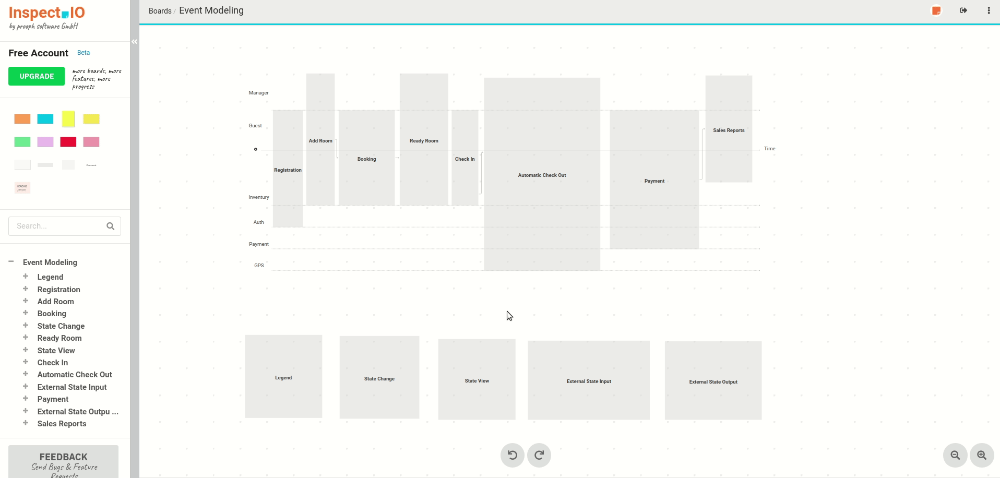

# InspectIO

InspectIO [Docs](https://github.com/event-engine/inspectio/wiki) &amp; [Issue Tracker](https://github.com/event-engine/inspectio/issues)

## Event Storming and Modeling

## Introduction Slides

[From Event Storming to working code](https://slides.com/prooph/deck/fullscreen)
